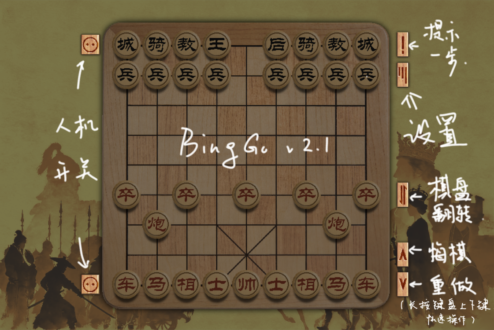
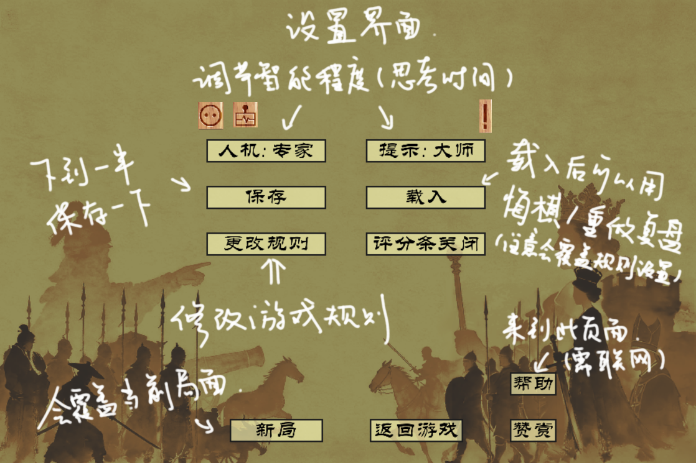
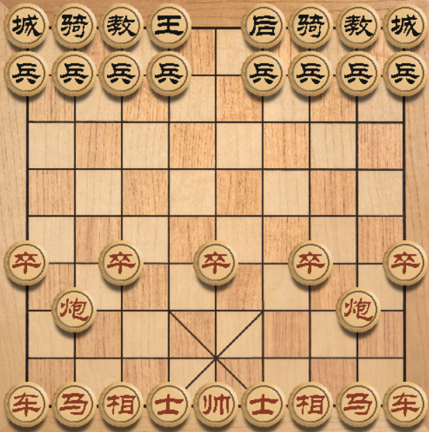

# BingGo 2

A completely rewritten version of BingGo.

**全新重写： 象棋 vs. 国象！ B站账号：[BingGo独立游戏](https://space.bilibili.com/509538586)，欢迎关注！~**

**最新版本提供了[联机对战](#联机对战)功能，来和朋友玩一局吧！**

## 界面介绍

<!--  -->

## 规则介绍

大部分规则沿用**象棋**or**国际象棋**，为调整游戏平衡，以下为若干**规则修改**：

初始局面：

0. 国象后翼的**骑士**和**主教**位置互换，以保留**双色相**。中象先手。你可以使用**fen**在**更多规则设置**中修改先手和初始局面，fen简介参见：[deepseek.com/share/q20pvt9t2luoy0u7it](https://chat.deepseek.com/share/q20pvt9t2luoy0u7it)。

中象方：

1. 取消河界，**卒**初始即为过河卒，**相**、**士**可以全棋盘移动。

2. 为更好地面对主教进攻，**相**可以斜向移动一步或两步（不可跳子）。

3. **士**可以前后左右或斜向移动一格，即与黑方的王走法相同。

4. **炮**可以越子移动。

5. **卒**到底线**默认无法升变**。但你可以**通过设置开启**这一特性，将底线卒升变为新棋子**将**（注意不是原象棋中的将，可以被吃），获得中国象棋所有子的走法。

国象方：

6. **王**不允许进入九宫。**你可以在设置中关闭这一特性。**

7. 保留**王车易位**特性，删去**过路兵**走法。

您也可以**使用betza修改棋子走法**，betza使用教程参见：[readme/betza.md](readme/betza.md)。

## 联机对战

版本v2.2.0提供了联机对战功能，房主可以通过**设置-create**进入联机模式，双方约定并输入同一个**房间名**（请尽可能保证不与之前房间名的重合，不要包含空格），另一方通过**设置-join**加入房间，确定后游戏开始。加入房间者先手，房主后手。

规则由房主决定，如要修改规则或初始局面，房主可以**在创建房间前修改规则设置**，保存后再开始即可应用规则。

## 游戏下载

**目前最新版本：BingGo v2.2.0 pk_version**

gitee下载：

蓝奏云下载：

所有发行版：[BingGo2/releases/](https://gitee.com/windbell0711/BingGo2/releases/)

## 支持

## 致谢

*Powered by [FairyStockFish](https://fairy-stockfish.github.io/).*

*[pygame-ce](https://pyga.me/docs/index.html)*
