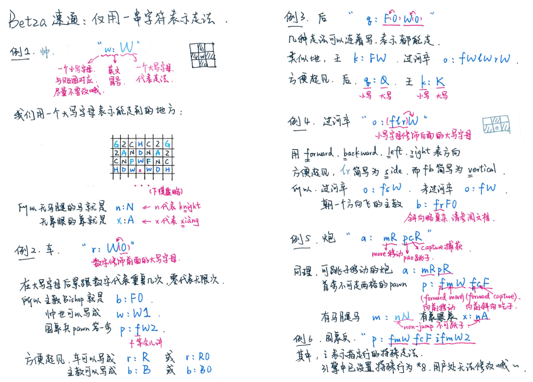

# Betza

用户可以使用Betza表示法，对**棋子走法**进行修改。

## 简明教程



## 常见错误

1. 格式应为“`小写英文字母 英文冒号 表达式`”
2. 小写英文字母代表棋子名称，提供fen和贴图的识别，故多个棋子不可共用一个名称，且必须在`rnbkqpoacmxswj`的范围内。不建议修改此项。
3. 冒号是英文半角的！`:`是合法的，`：`是非法的。
4. 表达式格式为`[(零个及以上个小写字母)(一个大写字母)(零个或一个0到8的数字)]*n`，比如`fmWfcFifmW2`，具体参见[教程](#简明教程)和[文档](#官方文档)。Betza表达式存在更复杂的用法，在此没有介绍，因而如果你键入了进阶用法，游戏会提示“可能有误”，如果你确信没有错误，请忽略此提示。
5. 部分棋子存在规则已经写死在程序中，无法更改。如`p`和`o`的升变信息，修饰符`i`对应的特殊行，`CustomPiece7`即帅的走子范围限制等，具体参见[ini template](#初始化模板)。


## 官方文档

[https://www.gnu.org/software/xboard/Betza.html](https://www.gnu.org/software/xboard/Betza.html)

## 初始化模板

我们使用初始化模板来生成FSF可以识别的ini规则文件，模板如下：

```ini
[binggo]
maxRank = 9
maxFile = 9

; Note that fen and some pieces might be declared twice
startFen = rnbk1qnbr/pppp1pppp/9/9/9/O1O1O1O1O/1A5A1/9/CMXSWSXMC w kq - 0 1

customPiece1 = j:NB2RmpRcpR
customPiece2 = x:B2
customPiece3 = o:fsW
customPiece4 = s:K
customPiece5 = a:mRpR
customPiece6 = c:R
customPiece7 = w:W
customPiece8 = m:nN

customPiece9 = k:K
customPiece10 = $queen_inf
customPiece11 = r:R
customPiece12 = b:B
customPiece13 = n:N
customPiece14 = p:mfWcfFimfR2

; Redeclare
$BLANK

$white_promo
promotionPawnTypesBlack = p
promotionPieceTypesBlack = rqnb
promotionRegionBlack = *1
enPassantRegion = -

castling = true
castlingKingFile = d
castlingKingsideFile = f
castlingRookKingsideFile = i
castlingQueensideFile = b
castlingRookQueensideFile = a

checking = true
doubleStep = true
doubleStepRegionBlack = *8
; doubleStepRegionWhite = *4

extinctionPieceTypes = Wk
extinctionValue = loss
extinctionPseudoRoyal = true
perpetualCheckIllegal = true
moveRepetitionIllegal = true

nFoldRule = 4
nFoldValue = loss
nFoldValueAbsolute = true
stalemateValue = loss

mobilityRegionWhiteCustomPiece7 = d1 e1 f1 d2 e2 f2 d3 e3 f3
$king_enter_palace
```

设置信息如下：

```python
repl_dict: dict[str, dict[int, str]] = {
    "queen_inf": {
        0: "q:B3R3",
        1: "q:BR",
        # 2: "q:WDHFNCAZG",
    },
    "white_promo": {
        0: "pawnTypes = p",
        1: "pawnTypes = po\npromotionPawnTypesWhite = o\n"
            "promotionPieceTypesWhite = jcaxsm\npromotionRegionWhite = *9",
    },
    "king_enter_palace": {
        0: "mobilityRegionBlackCustomPiece9  = a1 a2 a3 b1 b2 b3 c1 c2 c3 g1 g2 g3 h1 h2 h3 i1 i2 i3 *4 *5 *6 *7 *8 *9",
        1: "",
    },
}
swit_default = {
    "queen_inf": 0, "white_promo": 1, "king_enter_palace": 0
}
```

更多内容欢迎访问gitee代码仓库[BingGo2](https://gitee.com/windbell0711/BingGo2)进一步了解。
